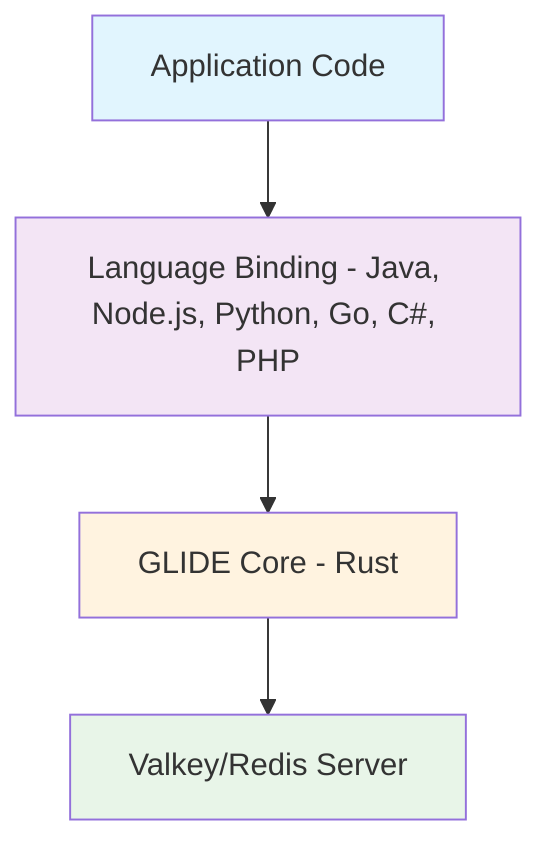

import { Aside } from '@astrojs/starlight/components';

<Aside type="caution" title="Work In Progress!">
  This documentation site is under construction and is not yet complete!

  For official Valkey GLIDE documentation, please refer to the official [Valkey GLIDE](https://github.com/valkey-io/valkey-glide) Github.
</Aside>

## Architecture That Scales

### The Power of a Unified Core

Valkey GLIDE uses a layered architecture with a Rust core and language-specific bindings. This design ensures consistency across languages while allowing for idiomatic interfaces in each supported programming language

## Key Components Explained

### Application Layer

This is where your application code interacts with Valkey GLIDE. The application layer is responsible for:

Command Creation: Applications construct commands using language-specific APIs
Parameter Validation: Type checking and validation before command execution
Result Processing: Handling returned data in language-appropriate formats
Error Handling: Application-level error handling and recovery strategies
Applications can interact with Valkey GLIDE in both synchronous and asynchronous modes, depending on the language and configuration.

### Language Binding Layer

The language binding layer provides idiomatic interfaces for each supported programming language:

Python: Offers Pythonic APIs with support for async/await, context managers, and type hints
Java: Provides Java-style interfaces with proper exception handling and Java collections integration
Node.js: Implements Promise-based APIs and callback patterns familiar to JavaScript developers
Go (public preview): Exposes Go-idiomatic interfaces with proper error handling and concurrency patterns
C# - Currently under active development.
Each language binding is responsible for:

Type Conversion: Converting language-specific types to FFI-compatible formats
Memory Management: Coordinating with language garbage collectors
API Design: Providing language-appropriate patterns and idioms
Documentation: Generating language-specific documentation and examples

### FFI Boundary Layer

The Foreign Function Interface (FFI) boundary is the critical bridge between language-specific code and the Rust core. This layer:

Defines Data Exchange Contracts: Strict interfaces for passing data between languages
Manages Memory Ownership: Controls how memory is shared and transferred
Handles Callbacks: Enables event propagation across language boundaries
Ensures Safety: Prevents memory leaks and undefined behavior
The FFI layer is implemented using language-specific FFI mechanisms:

Python: Uses PyO3
Java: Uses JNI (Java Native Interface)
Node.js: Uses N-API
Go: Uses CGO

### Rust Core Layer

The heart of Valkey GLIDE is implemented in Rust, providing:

Command Routing: Determines which node should receive each command
Connection Management: Maintains and monitors connection pools
Protocol Handling: Implements the Redis Serialization Protocol (RESP)
Cluster Topology: Tracks and updates cluster node information
Error Handling: Implements retry logic
The Rust core ensures consistent behavior across all language bindings while leveraging Rust's safety guarantees and performance characteristics.

### Network Communication Layer

The network layer handles all communication with Valkey/Redis servers:

TCP Connection Management: Establishes and maintains TCP connections
TLS Support: Implements secure communication when configured
I/O Buffering: Optimizes network buffer usage for performance
Timeout Handling: Manages connection and command timeouts
