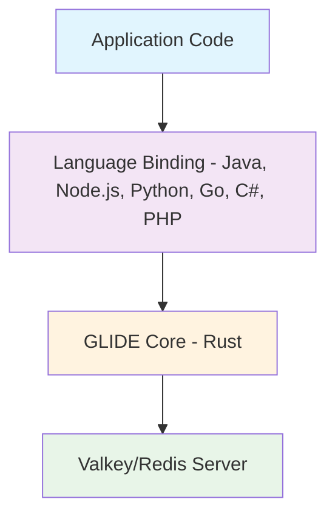

import { Aside } from '@astrojs/starlight/components';

<Aside type="caution" title="Work In Progress!">
  This documentation site is under construction and is not yet complete!

  For official Valkey GLIDE documentation, please refer to the official [Valkey GLIDE](https://github.com/valkey-io/valkey-glide) Github.
</Aside>

Valkey GLIDE is built on a sophisticated, layered architecture designed to deliver consistent, high-performance database interaction across multiple programming languages. 
It feature a **unified core engine written in Rust**, which handles all the complex, low-level tasks of client-server communication. 

Your application will interacts with a language-specific clients (e.g., for Python, Java, or Node.js) which wraps around the Rust core.
This aims to provides a familiar and idiomatic API for developers while ensuring the same performance, safety guarantees, and consistent behavior across all clients.

### Application Layer

This is where your application code interacts with Valkey GLIDE. The application layer is responsible for:

* **Command Creation:** Applications construct commands using language-specific APIs.
* **Parameter Validation:** Type checking and validation before command execution.
* **Result Processing:** Handling returned data in language-appropriate formats.
* **Error Handling:** Application-level error handling and recovery strategies.

Applications can interact with Valkey GLIDE in both synchronous and asynchronous modes, depending on the language and configuration.

### Language Binding Layer

The language binding layer provides idiomatic interfaces for each supported programming language. 
For example, The Python client offers pythonic APIs with support for async/await, context managers, and type hints
while the Node.js client implements promise-based APIs and callback patterns familiar to JavaScript developers.

In general, each language binding is responsible for:

* **Type Conversion:** Converting language-specific types to FFI-compatible formats.
* **Memory Management:** Coordinating with language garbage collectors.
* **API Design:** Providing language-appropriate patterns and idioms.
* **Documentation:** Generating language-specific documentation and examples.

### FFI Boundary Layer

**The Foreign Function Interface (FFI)** a conceptual Rust boundary that serves as the critical bridge between language-specific clients and the Rust core. In general, it handles:
* **Defines Data Exchange Contracts:** Strict interfaces for passing data between languages
* **Manages Memory Ownership:** Controls how memory is shared and transferred
* **Handles Callbacks:** Enables event propagation across language boundaries
* **Ensures Safety:** Prevents memory leaks and undefined behavior

<Aside>
The FFI layer is implemented using language-specific FFI mechanisms, e.g. Py03 for Python or JNI (Java Native Interface) for Java.
</Aside>

### The Rust Core

The heart of Valkey GLIDE is implemented in Rust and is in charge of:
* **Command Routing:** Determines which node should receive each command.
* **Connection Management:** Maintains and monitors connection pools.
* **Protocol Handling:** Implements the Redis Serialization Protocol (RESP).
* **Cluster Topology:** Tracks and updates cluster node information.
* **Error Handling:** Implements retry logic.

The Rust core ensures consistent behavior across all language bindings while leveraging Rust's safety guarantees and performance characteristics.
