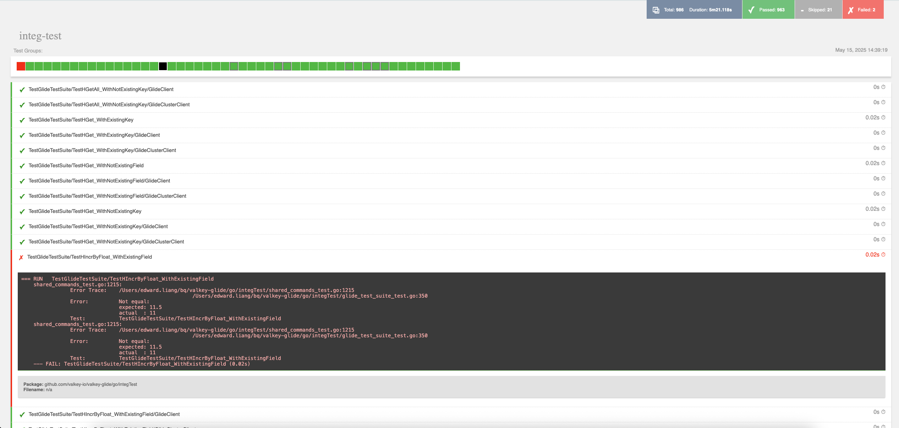

import { Aside } from '@astrojs/starlight/components';

We run our tests using Go's `testing` package. For convenience, we bundled test configuration and logging into makefile commands to simplify the process.

## Test Categories

The Valkey GLIDE Go wrapper has three main categories of tests:

1. **Unit Tests**: Tests that verify individual components in isolation
2. **Example Tests**: Runnable examples that serve as documentation and basic functionality tests
3. **Integration Tests**: Tests that verify the integration with Valkey/Redis servers
   * **Standard Integration Tests**: Tests basic functionality against Valkey/Redis servers
   * **Module Tests**: Tests specific Valkey/Redis modules functionality
   * **PubSub Tests**: Tests PubSub functionality
   * **Long Timeout Tests**: Runs tests with timeouts that may take longer than normal tests

To run unit tests, use:

```bash
make unit-test
```

To run all examples:

```bash
make example-test
```

To run standard integration tests (excluding module tests):

```bash
make integ-test
```

To run module-specific tests:

```bash
make modules-test
```

To run pubsub tests:

```bash
make pubsub-test
```

To run these tests:

```bash
make long-timeout-test
```

## Running Specific Tests

For all of the above tests, we can specify individual tests, or tests matching a pattern, using the `test-filter=<regex>` parameter to specify a filter pattern to use.

```bash
# Run with a specific prefix (ex. run all tests that start with TestSet)
make integ-test test-filter=TestSet

# Run with a specifc pattern (ex. run all tests that start with TestSet or TestGet)
make integ-test test-filter="Test\(Set\|Get\)"
```

## Additional Parameters

Integration and modules tests accept `standalone-endpoints`, `cluster-endpoints` and `tls` parameters to run tests on existing servers.
By default, those test suites start standalone and cluster servers without TLS and stop them at the end.

```bash
make integ-test standalone-endpoints=localhost:6379 cluster-endpoints=localhost:7000 tls=true
```

## Test Reports and Results

Alongside terminal output, test reports are generated in `reports` folder.

An example of what the report looks like when an error occurs:


